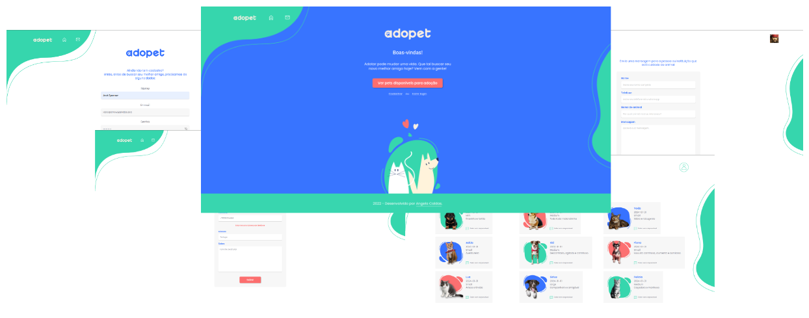

<div id="top" align="center">

  # Adopet API

  
  
  
  <a href='https://eslint.org/' target='_blank'></a>
  <a href='https://prettier.io/' target='_blank'></a>

  <br>

  > API RESTful para uma empresa fictícia de adoção de animais, desenvolvido para um Challenge Back-End.

  <p align="center">
    
  </p>

  <a>Potuguese</a> -
  <a href="./docs/en/README.md">English</a>

</div>

## 🤖 Tecnologias

<div align="center">
  <a href='https://nodejs.org/' target='_blank'>
  
  <a href='https://expressjs.com/' target='_blank'>
  <a href='https://jwt.io/' target='_blank'></a>
  <a href='https://www.postgresql.org/' target='_blank'></a>
  <a href='https://sequelize.org/' target='_blank'></a>
  <a href='https://jestjs.io/' target='_blank'></a>
  <a href='https://www.docker.com/' target='_blank'></a>
  <a href='https://render.com/' target='_blank'></a>
  <a href='https://nodemon.io/' target='_blank'></a>
  <a href='https://docs.github.com/en/actions' target='_blank'></a>
</div>

## 📋 Requisitos
- Node.js e NPM
- Banco de dados [Postgres](https://www.postgresql.org/)
- [Docker](https://www.docker.com/) e [docker compose](https://docs.docker.com/compose/)


## ⚙️ API

🧩 [adopet.api.sapituca.site](http://adopet.api.sapituca.site/)

🗂 [Documentação](https://documenter.getpostman.com/view/22093498/2sA35MxyP2)


## 🧑🏽‍💻 Usando

Clonar o repositório
```bash
git clone [repositório]
```

Seguir para o diretório da API
```bash
cd adopet-api/
```

🏗️ **Construindo e executando a aplicação**

Iniciar a API e o bando de dados
```bash
docker compose up --build -d
```

Migrar das tabelas do banco de dados
```bash
docker compose exec api npx sequelize-cli db:migrate
```

> A API estará disponível em http://localhost:9000.

💣 **Testando a API**... 🤞🏽

Criar banco de dados de teste
```bash
docker compose exec api npx sequelize-cli db:create --env test
```

Realizar a migração das tabelas
```bash
docker compose exec api npx sequelize-cli db:migrate --env test
```

Executar todos testes
```bash
docker compose exec api npm run test
```

Executar testes de integração
```bash
docker compose exec api npm run test:integration
```

ou executar testes com filtro
```bash
docker compose exec api \
npm run test:integration \
-- api/__test__/integration/routes/authRoute.test.js
```

📦 **Contruindo uma Imagem**

Construa uma imagem ao executar: 
```shell
docker build -t adopet-api:latest .
```


## ♾️ CI/CD

**Github Actions** foi escolhido como ferramenta no desenvolvimento de CI pela simplicidade na construção de workflows, por estar integrado ao repositório da aplicação e por questões didáticas para explorar a ferramenta.

A escolha do **[Render](https://render.com/)** como plataforma de deploy da API e do Banco de Dados, foi devido a simplicidade na realização de deploys e ao plano gratuito que abrange banco de dados **Postgres**, deploy de **Web Services** construído em **Node.js**, além de dar suporte Continuos Deployment realizando **deploys automáticos** integrado às branchs do **Github**.


### 🧪 **Build e Testes**
Rotinas são executadas para testar a aplicação, construir um imagem do **Docker** e registrá-la no **Docker Hub** no momento que o repositório receber um **Pull Request** para a branch `main`.

### 🚀️ **Deploy**
O Banco de Dados e a API são constrúidos através dos serviços do **Render**, no qual disponibiliza sempre a última versão da aplicação ao realizar deploys automáticos baseados na branch `main` deste repositório.


## 📚 Referências
- [Docker's Node.js guide](https://docs.docker.com/language/nodejs/)
- [Custom Domains | Render Docs](https://docs.render.com/custom-domains#configuring-dns-to-point-to-render)
- [Configuring Namecheap DNS | Render Docs](https://docs.render.com/configure-namecheap-dns)

---

<a href='#top'>🔼 Voltar ao topo</a>
